```{r setup, include = FALSE}
source("../R/utils.R")
source("../R/mcmc.R")
source("../R/functions.R")
source("../R/pkg_install.R")
load_pkgs(skip = "tikzDevice")
zmargin <- theme(panel.spacing = grid::unit(0, "lines"))
theme_set(theme_bw())
library(targets)
knitr::opts_chunk$set(echo = FALSE, dpi = 200, optipng = knitr::hook_optipng)
options(bitmapType = "cairo")
```

```{r load, include=FALSE}
## https://github.com/ropensci/targets/issues/230
withr::with_dir("..",tar_load(ag_model_pcsc))
withr::with_dir("..",tar_load(ag_model_full))
withr::with_dir("..",tar_load(ag_mcmc0))
withr::with_dir("..",tar_load(all_ci))
withr::with_dir("..",tar_load(all_contr_ci))
withr::with_dir("..",tar_load(ag_compdata))
withr::with_dir("..",tar_load("ag_model_pcsc"))
withr::with_dir("..",tar_load("ag_model_pc"))
withr::with_dir("..",tar_load("ag_model_sc"))
withr::with_dir("..",tar_load("ag_model_indep"))
withr::with_dir("..",tar_load("ag_model_pcsc_add"))
mnames <- c("pcsc", "pcsc_add", "pc", "sc", "indep")
```

```{r utils}
withr::with_dir("..",tar_load(ag_compdata))
corhmm_bounds <- log(c(lwr=0.1, upper = 100*ape::Ntip(ag_compdata$phy)))
corhmm_prior <- log(c(lwr=1, upper = 10*ape::Ntip(ag_compdata$phy)))
corhmm_mid <- mean(corhmm_bounds)
## order of parameters
levs <- c(outer(FUN = paste, sep = ".",
      c("loss", "gain"),
      c("sc", "pc",
        paste0("ag_", c(outer(paste0("pc", 0:1), paste0("sc", 0:1), paste, sep = "_"))))
      ))
contr_levs <- c(outer(FUN = paste, sep = "_",
                      c("intercept", "sc", "pc", "pcxsc"),
                      c("loss", "gain")))

fix_all_ci <- function(x, levels = NULL) {
    x <- (x
        ## replace NA values with Inf/-Inf so bars extend full range
        %>% replace_na(list(upr = Inf, lwr = -Inf))
        ## utility var for below-bounds estimates
        %>% mutate(lwr_bound = (estimate <= corhmm_bounds[["lwr"]]))
    )
    if (!is.null(levels)) {
        ## reorder levels as above
        x <- (x
            %>%  mutate(across(term, factor, levels = levels))
        )
    }
    return(x)
}
```

<!-- 
apa.csl is a slightly hacked version of APA 
  (modified for "et al" after 2 authors in text)
-->
<!-- .refs is style for reference page (small text) -->
<style>
.refs {
   font-size: 14px;
}
h2 { 
 color: #3399ff;		
}
h3 { 
 color: #3399ff;		
}
.title-slide {
   background-color: #55bbff;
}
<!-- https://stackoverflow.com/questions/50378349/force-column-break-in-rmarkdown-ioslides-columns-2-layout -->
.forceBreak { -webkit-column-break-after: always; break-after: column; }
</style>
<!--    content: url(https://i.creativecommons.org/l/by-sa/4.0/88x31.png)
>
<!-- Limit image width and height -->
<style type="text/css">
img {     
  max-height: 560px;     
  max-width: 800px; 
}
</style>

\newcommand{\P}{\mathbf P}
\newcommand{\Q}{\mathbf Q}
\newcommand{\pr}{\textrm{Prob}}

## Acknowledgments

* NSERC ($$$)
* Lucas Eckert, Sigal Balshine, Jess Miller, John Fitzpatrick

# The evolutionary problem

## Correlated traits

* How do we analyze correlations in structured data?
* ... specifically, **phylogenetic** (tree) data?
* correlations between **organismal traits**
* ... specifically, *discrete* traits

## accessory glands


* "organs involved in reproduction but not directly in the production or release of gametes"
* typically in males, associated with seminal fluid
* often associated with **sperm competition**
* in fish, may also be associated with **male parental care**

## examples

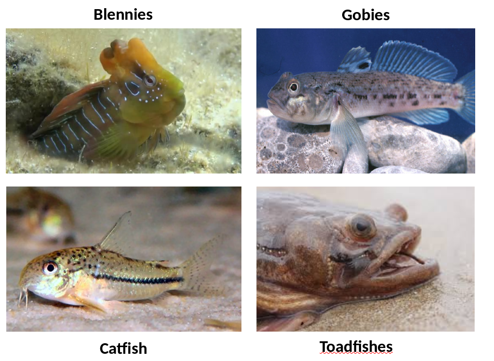

## data (607 species total)

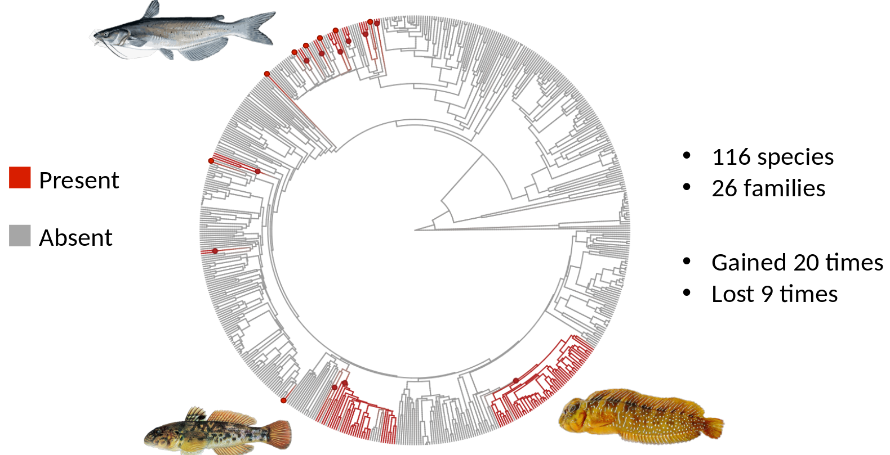

## associated traits

* **pair** vs. **group spawning**  
(proxy for sperm competition)
* presence of **male parental care**

## data on all traits

<center>

<!-- 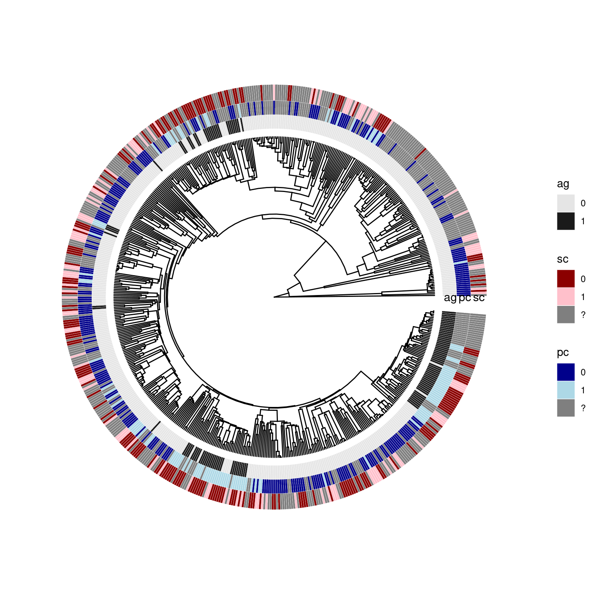 -->
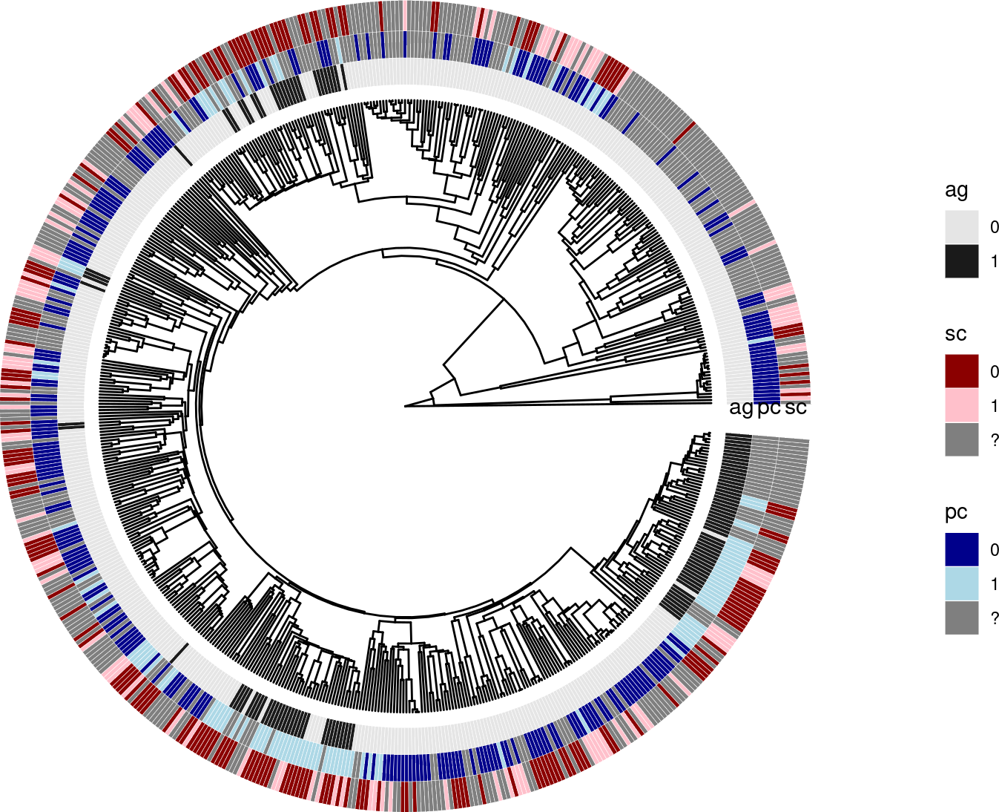

</center>

# From evolution to statistics

## modeling correlated evolution

* model the influence of a trait on the *rate of change* of another trait [@pagelDetecting1997]
   * is the rate of gain/loss of AGs (in)dependent of whether a species (lineage) has group vs pair spawning, or male parental care?
* likelihood ratio tests for (in)equality of rates

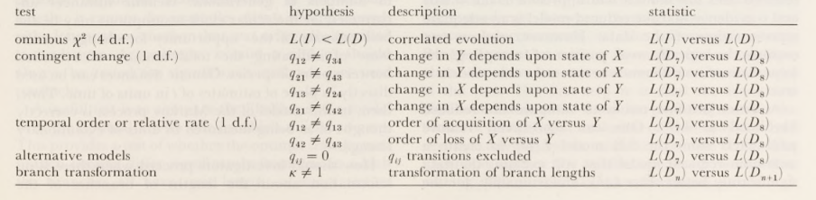

## setting up the model

* continuous-time, discrete-state Markov process
* rates defined as pairwise **hazards** (states $i$ and $j$)
$$
h_{ij}  = \lim_{\Delta t \to 0} P(i \to j\:\textrm{between}\:t\:\textrm{and}\:t+\Delta t)
$$
* 8 states (3 binary traits, 2 × 2 × 2)

## flow diagram

<center>

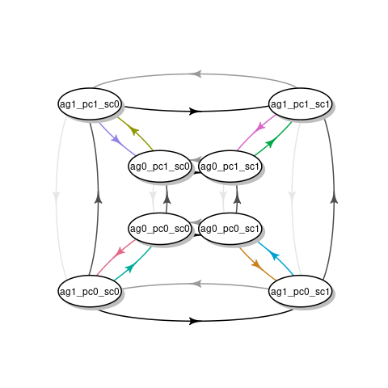

</center>

## computing the likelihoods

* create a **rate matrix** $\Q$ with $Q_{ij} = h_{ij}$ ($i \neq j$), $Q_{ii} = -\sum_{i\neq j} h_{ij}$
* probabilities of change along a branch: **matrix exponential**
   * i.e. given rate matrix $\Q$, transition probabilities over time $\Delta t$ are $\exp(\Q \Delta t)$
* combining probabilities for the whole tree: ??

## pruning algorithm [@felsensteinMaximum1973]

* use independence of graph nodes *conditional on a value at an intervening node*
* recursive computation starting from tips
* at tips, probability is 1 for observed trait value, 0 for others  
(or evenly distributed across unknown traits)

$$
\begin{split}
& \pr(k\:\textrm{at parent}) \\
& \quad = \pr(k\:\textrm{at parent}|\textrm{data at child 1}) \times \\
& \qquad \quad \pr(k\:\textrm{at parent}|\textrm{data at child 2}) \\
& \quad = \sum \left( \pr(k\to i) \cdot \pr(i \textrm{ at child 1})\right) \times \\
& \qquad \quad \sum \left( \pr(k \to i) \cdot \pr(i \textrm{ at child 2})\right)
\end{split}
$$

## pruning algorithm example

From @harmonPhylogenetic2019 (CC-BY-4.0)

<center>

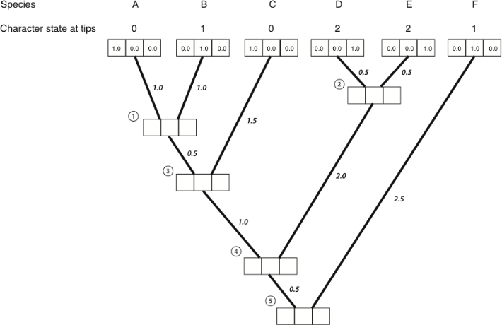

</center>

## pruning algorithm example

From @harmonPhylogenetic2019 (CC-BY-4.0)

<center>

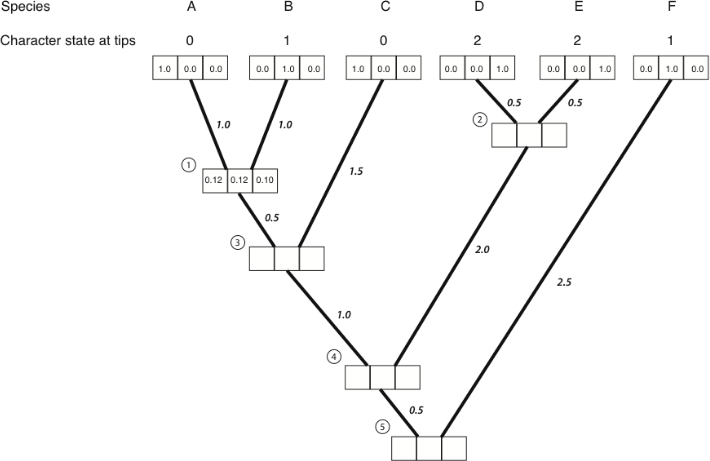

</center>


## pruning algorithm (complete)

* once we get to the **root**, compute $\sum \textrm{Prior(i)} \cdot \pr(i)$
* now apply your favourite optimization algorithm ...

## LRTs

* using code from `corHMM` package [@corHMM; @beaulieu_hidden_2014]

<center>

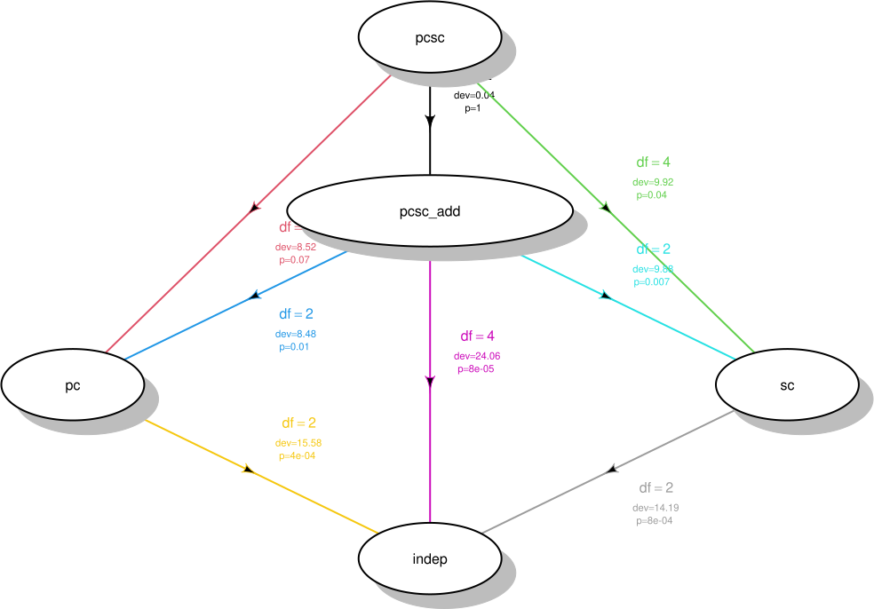

</center>

# pause for statistical philosophy

## can we do better inference?

* pairwise comparisons are unsatisfying (e.g. "the interaction term and the combined effect of sperm competition and the pc × sc interaction are non-significant, all other effects are significant") 

## rank by AIC/BIC/etc. ...

```{r ictab}
ag_models <- paste0("ag_model_",
                    mnames)
fake_nobs <- 30 ## ?? something weird about targets evaluation:
dtab <- tibble(
    model = mnames,
    desc = c("AG dep on PC, SC & interaction",
             "AG dep on PC, SC additively",
             "AG dep only on PC",
             "AG dep only on SC",
             "AG evol indep of PC, SC"))
atab <- (mget(ag_models)
    |> setNames(mnames)
    |> map_dfr(glance, nobs = fake_nobs, .id = "model")
    |> mutate(negLL = -1*logLik)
    |> dplyr::select(-logLik)
    |> mutate(across(c(AIC, BIC, negLL, AICc),  ~ . - min(.)))
    |> arrange(AICc)
    |> full_join(dtab, by = "model")
    |> dplyr::select(desc, df, AICc, AIC, BIC, negLL)
    |> setNames(c(" ", "df", "ΔAICc", "ΔAIC", "ΔBIC", "ΔnegLL"))
)
knitr::kable(atab, digits=2)
```

## BayesTraits

* what about a Bayesian solution?
* @pagel_bayesian_2006: need to integrate over phylogenetic uncertainty
* chose to assign rates to **rate classes**  
e.g. $\{q_{12}, q_{13}\} = \phi_1; \{q_{13}, q_{24}\}=\phi_2; \ldots$  
(certain assignments correspond to hypotheses of independence etc.)
* how many possible models? **Bell numbers** https://oeis.org/A000110  
($B(12) = 4213597$)
* need **reversible-jump** MCMC
* compare sample frequency of independent- vs dependent-evolution models to null

## BayesTraits posteriors

<center>

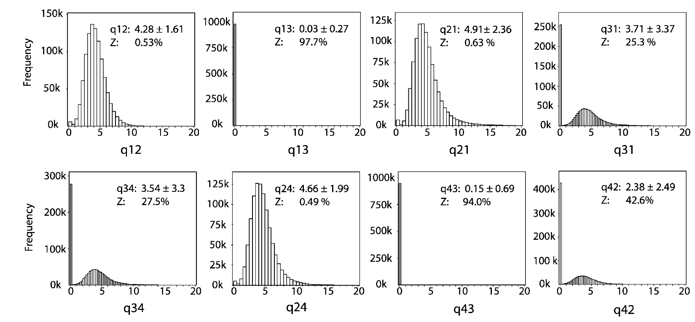

</center>

## possible approaches

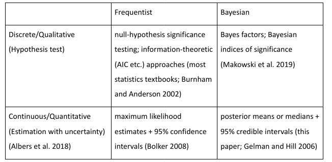

<!--
------------------------------------------------------------------------------------------------------
                             Frequentist                            Bayesian
---------------------        -------------------------------------  --------------------------------


Discrete/qualitative         null-hypothesis significance           Bayes factors; B. indices 
(hypothesis testing)         testing; AIC etc. (stats textbooks;    of significance (Makowski et al. 2019)
                             Burnham and Anderson 2002)

Continuous/quantitative      MLE etc. + confidence intervals        posterior means/medians +
(estimation w/ uncertainty)                                         credible intervals

-----------------------------------------------------------------------------------------------------
-->

## an approach to a quantitative solution

* **how much** do traits affect rates?

## set up contrasts

<center>


</center>

## contrast matrix

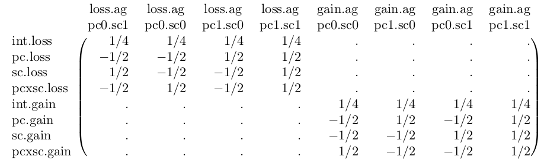

# back to statistics

## Bayesian estimation (MCMC)

* assume *independence* of spawning, parental care transitions  
(24 $\to$ 12 rates to estimate)
* compute log-likelihoods by methods described above
* decide on priors
* Metropolis-Hastings sampling with adaptive MVN candidate distribution [@vihola_robust_2012]
* random sampling over **tree block** (imputed phylogeny)

## priors

* form of **regularization**
* informative but neutral
* set "reasonable" lower/upper bounds for rates
   * e.g. with total branch length scaled to 1, hazards from 1 to 10 $\times$ (# species)
* assume log-Normal prior, with lower/upper bounds representing $\mu \pm 3 \sigma$
* priors on gain/loss ratio
* check **prior predictive samples** [@mcelreathStatistical2015; @gelmanBayesian2020]

## MCMC diagnostics/params

* 8 chains, 84000 iterations, burn-in of 4000, thin by 10 (640,000 samples)
* 12-24 hours on 8 cores
* (improved) R-hat statistics all $\leq 1.01$, effective sample sizes all $>1000$ [@vehtariRankNormalization2021]
* trace plots
* pairs plots

## pairs plots example


## results

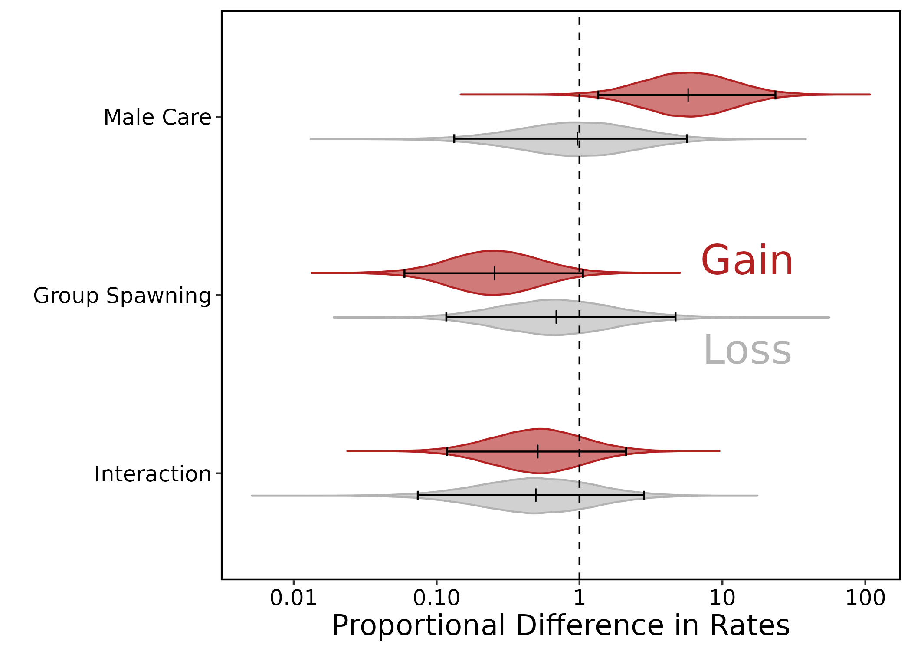

## sensitivity analyses

```{r ci_plot0, warning = FALSE, message = FALSE}
##
withr::with_dir("..",tar_load(ag_compdata))
withr::with_dir("..",tar_load(all_ci))

all_ci <- fix_all_ci(all_ci, levels = levs)

## extend NA confidence interval to limit of graph
gg_ci0 <- (ggplot(
    all_ci,
    aes(term, exp(estimate), ymin = exp(lwr), ymax = exp(upr),
        colour = method)
)
    + geom_linerange(position = position_dodge(width = 0.5), key_glyph = "path") 
    +   geom_point(position = position_dodge(width = 0.5))
    + colorspace::scale_colour_discrete_qualitative()
    + coord_flip()
    ## +     theme(legend.position="bottom")
    ## https://stackoverflow.com/questions/27130610/legend-on-bottom-two-rows-wrapped-in-ggplot2-in-r
    ## this was important when we had side-by-side graphs
    + guides(colour = guide_legend(reverse = TRUE),
             shape = guide_legend(reverse = TRUE))
             ## nrow = 2, byrow = TRUE,
    ##    reverse = TRUE))
)
## would like to make arrows ("<") at lower bounds larger, but manipulating
##  size aesthetic would also mess up bars (I think). Some hack?
gg_ci1  <- (gg_ci0
    + scale_y_log10(limits = exp(corhmm_bounds), oob = scales::squish)
    + aes(shape = factor(lwr_bound))
    + labs(y="rate", x = "")
    + geom_hline(yintercept =exp(corhmm_mid), lty=2)
    + geom_hline(yintercept = exp(corhmm_prior), lty=2, col="gray")
    ## 60 = "<"
    + scale_shape_manual(values = c(16, 60), guide = "none")
)
gg_ci_nowald <- (gg_ci0 %+% dplyr::filter(all_ci, method != "model_pcsc")
    +  scale_y_log10()
)
```

```{r contrast-ci, fig.width=8, fig.height = 6, warning = FALSE, message = FALSE}
method_levs <- c("mcmc_tb", "mcmc_0",
                 "mcmc_tb_nogainloss",
                 "full",
                 "model_pcsc",
                 "model_pcsc_add",
                 "model_pcsc_prior")
all_contr_ci <- (fix_all_ci(all_contr_ci, levels = contr_levs)
    |> filter(!grepl("net", term),
              !grepl("intercept", term),
              method != "priorsamp",
              !is.na(term))
    |> mutate(across(method, factor, levels =rev(method_levs)))
)
## reverse order of levels, *and* guide, so that both are top-to-bottom

gg_ci1C  <- (gg_ci0 %+% all_contr_ci
    + scale_y_log10(limits=c(1e-2, 1e3),
                    breaks = 10^seq(-2, 3),
                    labels = function(x) sprintf("%g", x),
                    oob = scales::squish,
                    expand = expansion(0,0))
    + labs(y="hazard ratio", x = "")
    + geom_hline(yintercept =1, lty=2)
    + aes(shape = method)
    + scale_shape_manual(values = c(scales::shape_pal(solid=TRUE)(6),9,10))
)
print(gg_ci1C)
```

## take-home messages from sensitivity analysis

* regularization matters (MAP $\approx$ full Bayes)
* sampling over tree blocks (imputation) helps a little bit
* gain/loss priors unimportant
* full 24-parameter model is problematic ...

## to-do list

* compute Bayes factors (bridge sampling)
* re-implement with HMC sampling in Template Model Builder (C++/autodiff engine) [@TMB2016]
* consider contrasts weighted by occupancy?
* extensions to hidden Markov models/covarion model [@beaulieu_hidden_2014]

## references {.refs}

