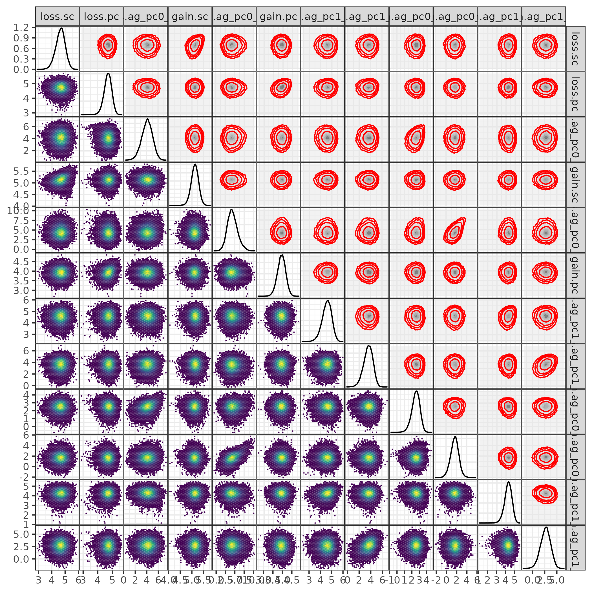
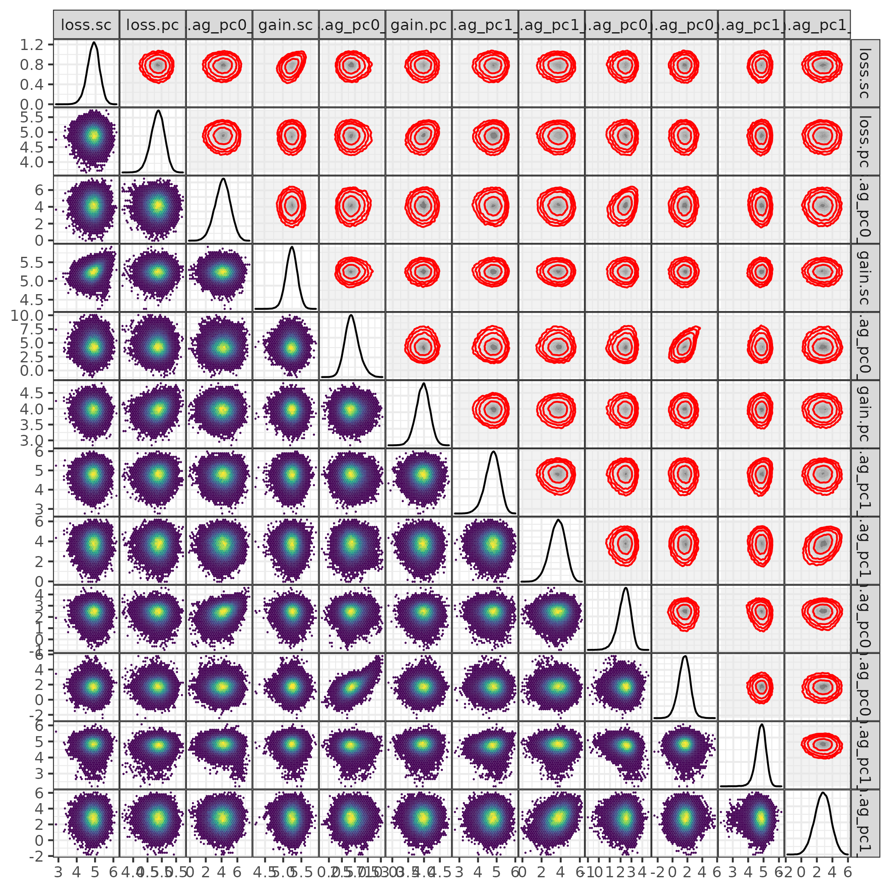
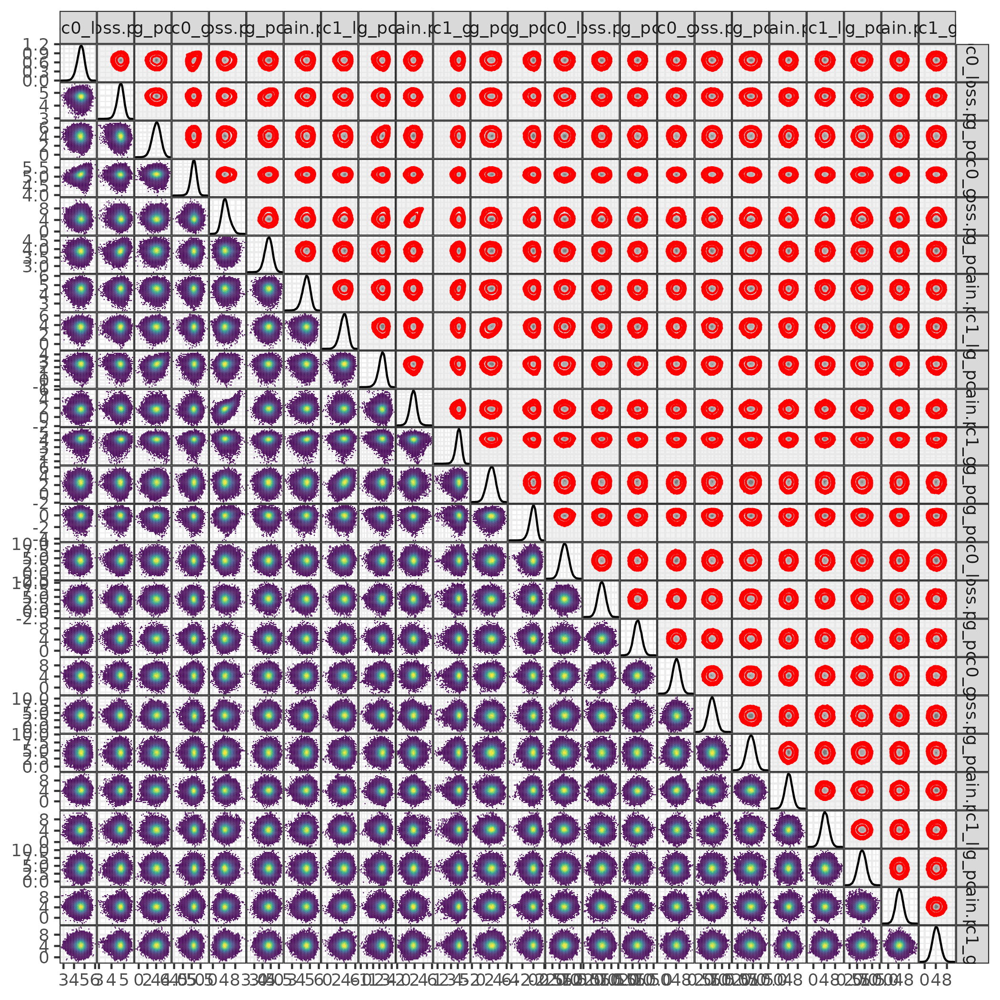
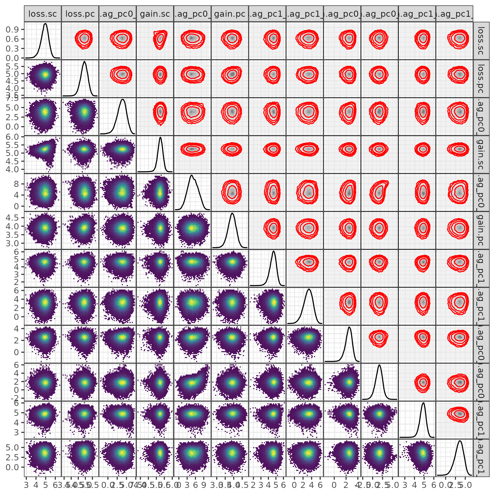

```{r setup, message=FALSE}
source("R/utils.R")
source("R/mcmc.R")
source("R/functions.R")
source("R/monitornew.R")
load_pkgs()
zmargin <- theme(panel.spacing = grid::unit(0, "lines"))
theme_set(theme_bw())
library(targets)
```

## fishphylo

This is the model that uses only the full/known phylogeny. (Probably irrelevant.)

```{r bayes_traceplot, fig.width=8, fig.height=8}
tar_load(traceplot_0)
print(traceplot_0)
```

```{r improved_rhat}
tar_load(ag_mcmc0)
aa <- do.call(abind, c(ag_mcmc0, list(along=3)))
aa2 <- aperm(aa,c(1,3,2), resize=TRUE)
monitor(aa2)
```

```{r bayes_pairs, fig.width=10, fig.height=10, echo=FALSE, eval=FALSE}
pairs(as.matrix(ag_mcmc0), gap = 0, pch = ".")
```

```{r bayes_pairs2, fig.width=10, fig.height=10, cache=TRUE}
tar_load(mc_pairsplots_0)

```

Contour levels are: 50%, 80% 90%, 95% (largest) highest posterior density regions.


## treeblock

The model that samples over the 'tree block' (sample of phylogeny reconstructions)

```{r traceplot_tb, fig.width=8, fig.height=8}
tar_load(traceplot_tb)
print(traceplot_tb)
```

```{r improved_rhat_tb}
tar_load(ag_mcmc_tb)
aa <- do.call(abind, c(ag_mcmc_tb, list(along=3)))
aa2 <- aperm(aa,c(1,3,2), resize=TRUE)
monitor(aa2)
```

```{r bayes_pairs_tb, fig.width=10, fig.height=10, cache=TRUE}
tar_load(mc_pairsplots_tb)

```

## full

```{r traceplot_full, fig.width=8, fig.height=8}
tar_load(traceplot_full)
print(traceplot_full)
```

```{r improved_rhat_full}
tar_load(ag_mcmc_full)
aa <- do.call(abind, c(ag_mcmc_full, list(along=3)))
aa2 <- aperm(aa,c(1,3,2), resize=TRUE)
monitor(aa2)
```

```{r bayes_pairs_full, fig.width=10, fig.height=10, cache=TRUE}
tar_load(mc_pairsplots_full)

```

## no_gainloss

```{r traceplot_tb_nogainloss, fig.width=8, fig.height=8}
tar_load(traceplot_tb_nogainloss)
print(traceplot_tb_nogainloss)
```

```{r improved_rhat_tb_nogainloss}
tar_load(ag_mcmc_tb_nogainloss)
aa <- do.call(abind, c(ag_mcmc_tb_nogainloss, list(along=3)))
aa2 <- aperm(aa,c(1,3,2), resize=TRUE)
monitor(aa2)
```

```{r bayes_pairs_tb_nogainloss, fig.width=10, fig.height=10, cache=TRUE}
tar_load(mc_pairsplots_tb_nogainloss)

```
