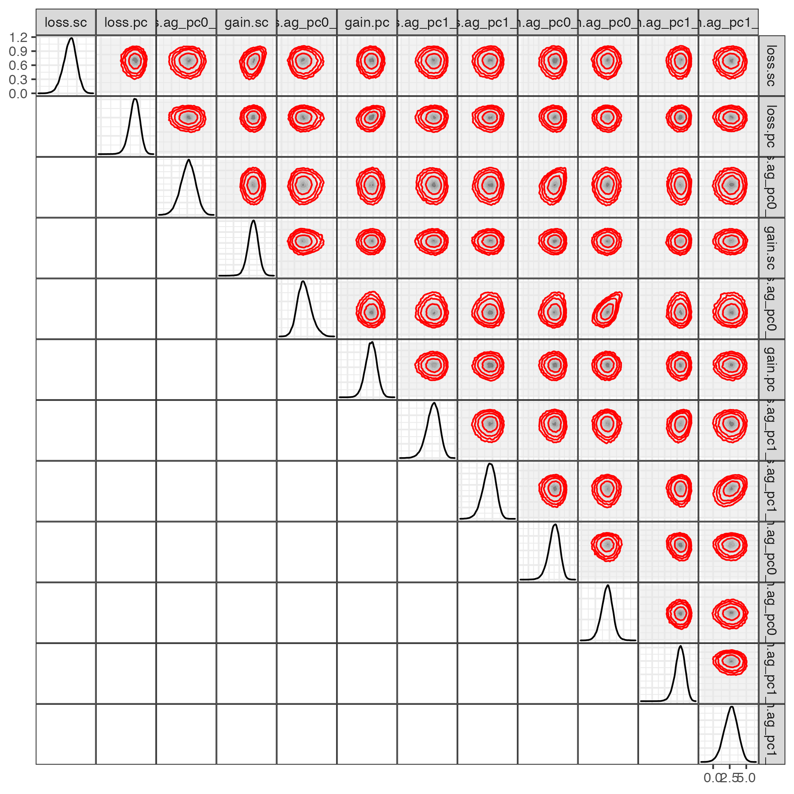
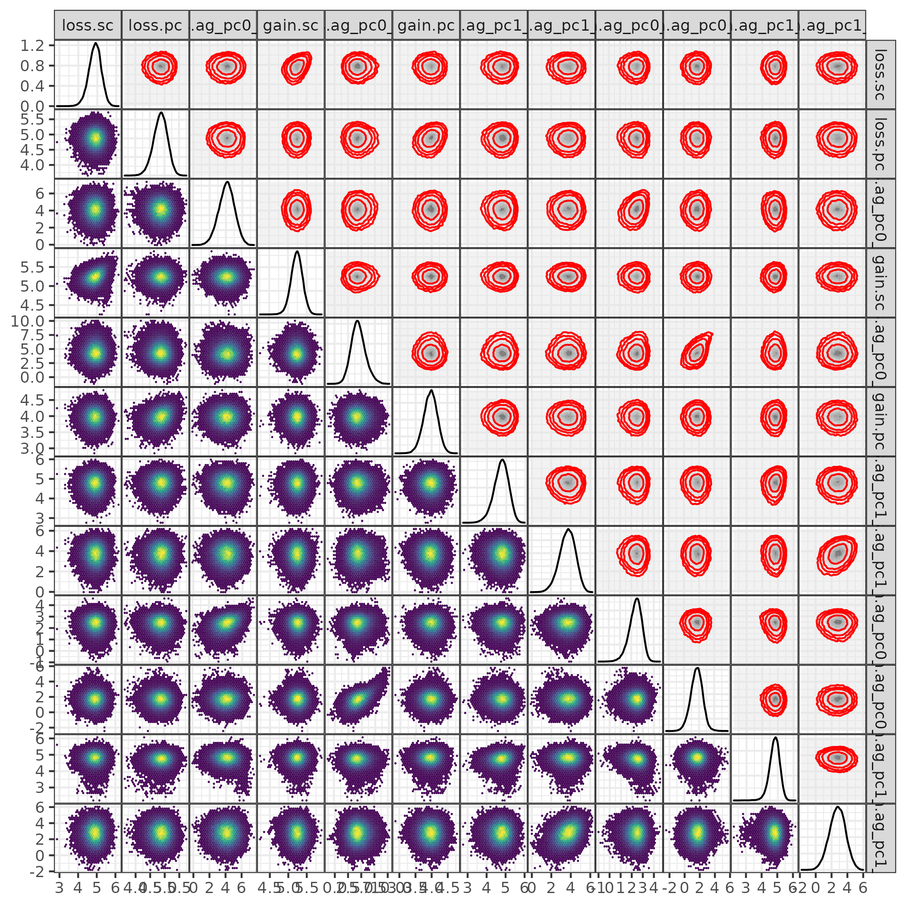
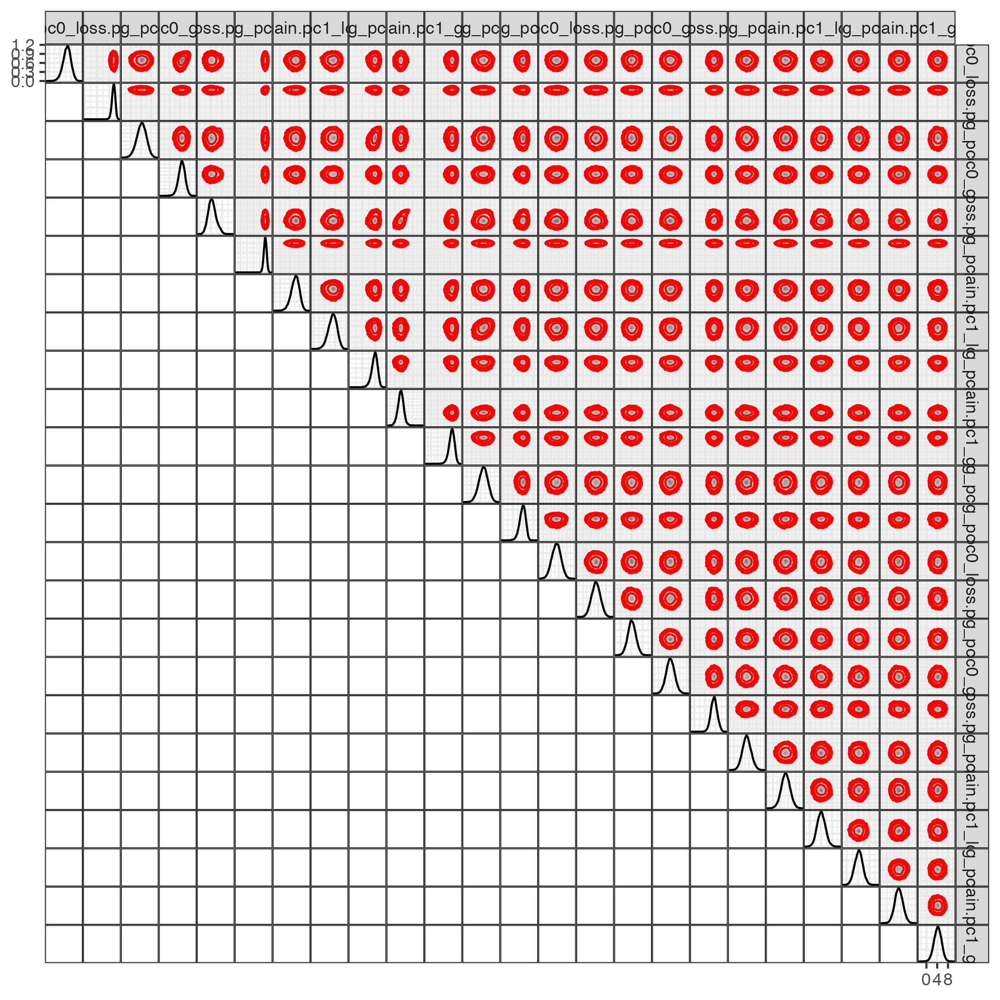
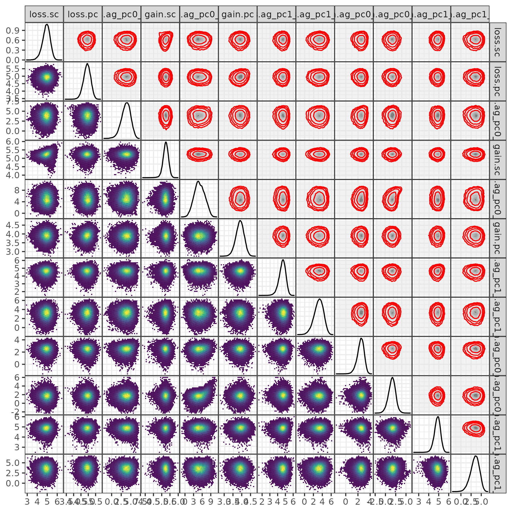

<!-- disable code folding entirely if not building as HTML? --  'r ifelse(knitr::is_html_output(),"hide", ...)' -->
<!-- **fix me**: reimplement as [target markdown](https://books.ropensci.org/targets/markdown.html#markdown) ? -->

```{r setup, include = FALSE}
source("R/utils.R")
source("R/mcmc.R")
source("R/functions.R")
source("R/pkg_install.R")
load_pkgs(skip = "tikzDevice")
zmargin <- theme(panel.spacing = grid::unit(0, "lines"))
theme_set(theme_bw())
library(targets)
knitr::opts_chunk$set(echo = FALSE, dpi = 200, optipng = knitr::hook_optipng)
options(bitmapType = "cairo")
## skip yellow
OkIt <- unname(palette.colors(n = 9, palette = "Okabe-Ito"))[-6]
```

<!-- use PNG for heavy graphics to avoid blowing up file size.
  -- see https://bookdown.org/yihui/rmarkdown-cookbook/optipng.html for info on installing OptiPNG-->

```{r load}
tar_load(ag_model_pcsc)
tar_load(ag_model_full)
tar_load(ag_mcmc0)
tar_load(all_ci)
tar_load(all_contr_ci)
tar_load(ag_compdata)
```

# Descriptive statistics

## Data

	
```{r mosaic, eval=FALSE, include=FALSE}
## cool but useless
(ag_compdata$data
  %>% mutate(ag = paste0("ag:",ag),
             pc = paste0("pc:",pc),
             sc = paste0("sc:",sc))
  %>% 
  ggplot() + 
  geom_mosaic(aes(x = product(pc, sc), fill = ag)) +
  geom_mosaic_text(aes(x = product(pc, sc), fill = ag), as.label = TRUE) +
  scale_fill_discrete_qualitative()
)
```

```{r barchart, fig.cap = "Numbers of species with each set of traits  (`0` = absent, `1` = present, `?` = unknown; `pc` = male parental care; `sc` = sperm competition (i.e. group spawning or ARTs); `ag` = accessory glands), depending on whether we use the partial (but fully genetically resolved) tree (`fishphylo`) or the imputed trees from @rabosky_inverse_2018 (`treeblock`)."}
tar_load(ag_compdata)
tar_load(ag_compdata_tb)
barplot_trans <- (. 
  %>% mutate(across(c(pc, sc), factor, levels = c(0:1, "?")))
  %>% mutate(across(ag, factor, levels = 1:0)) ## reverse order to get ag=1 on top of bars
)

bar_data <- (purrr::map_dfr(list(fishphylo = ag_compdata$data,
                    treeblock = ag_compdata_tb$data),
               barplot_trans,
               .id = "phylo")
    |> rename(`spawning mode`="sc")
)

gg1 <- (ggplot(bar_data, aes(x=pc, fill = ag))
  + geom_bar()
  + facet_grid(phylo~`spawning mode`, labeller = label_both)
  + scale_fill_discrete_qualitative(name = "accessory\nglands")
    + zmargin
    + labs(x="male parental care")
)
print(gg1)
```                         

The phylogenies in the treeblock are generated according to an imputation
scheme described in @rabosky_inverse_2018. We generated 100 stochastic character maps for each of 100 trees; the figure shows the average number of gains and losses per tree (i.e., average gains/losses across the stochastic character maps for each tree).

```{r simcounts, fig.cap = "average number of gains and losses of AGs simulated for each tree in the tree block"}
if (file.exists("simmap.rda")) {
x <- load("simmap.rda")
countsum <- (counts
    |> as_tibble()
    |> mutate(r = rep(1:100, each = 100))
    |> group_by(r)
    |> rename(gains = "ag0,ag1", losses = "ag1,ag0")
    |> summarise(across(c(gains, losses), mean))
    |> pivot_longer(c(gains, losses))
)
ggplot(countsum) + geom_histogram(aes(x=value), binwidth = 0.25, colour = "white") + facet_wrap(~name, scale = "free_x")
} else {
  warning("run figures.R?")
}
``` 


<!-- use ape::getMRCA() to identify families and geom_cladelab() ... ?? -->

```{r densitree, fig.cap = "densitree-style [@bouckaertDensiTree2010] mapping of tree blocks/phylogenetic uncertainty ", cache=TRUE, dev = "png", optipng = "-o7"}
targets::tar_load(treeblock)
mp <- do.call("c", treeblock)
ggtree::ggdensitree(mp, layout = "radial", alpha = 0.02)
```

```{r barchart_test, include = FALSE}
## bar chart that distinguishes group from ART?
tar_load(full_ag_data)
tar_load(treeblock)
ff <- full_ag_data |> get_ag_data(trait_names = c("ag", "care", "pairs.groups", "pairs.arts"), phylo = treeblock[[1]])
```

# Parameter definitions

## Transition matrices

As described in the main text, a continuous-time stochastic process for three binary traits has a total of 24 possible transitions where a single one of the three states changes. The figure below shows the full and reduced transition matrices. In the axis tick labels, `ag0_pc0_sc1` (for example) refers to the state without AGs (`ag0`), without male care (`pc0`), and with group spawning (`sc1`, loosely "sperm competition present"^[Hereafter we refer to pair spawning as "sperm competition absent" (`sc0`) and group spawning as "sperm competition present" (`sc1`), recognizing that this is an oversimplification.]). Parameter 1 quantifies the log(transition rate) of a switch to pair spawning in this state (i.e., to `ag0_pc0_sc0`). 

The assignment of numbers to rates is arbitrary, numbered in sequence in column-wise order. Knowing the assignment is only necessary when doing low-level computations based on the vector of parameters. The take-home information is which sets of transitions are constrained to be identical in the reduced model; these rates have the same number . In the reduced model (righthand plot), transitions that are assumed to have equal rates - because we assume that all transitions in spawning mode, and all transitions in male care, are independent of the other states - have the same ID number. Colours denote the estimated log(transition rate) for each parameter when the models are fitted by maximum likelihood. Below, we denote parameter 1 (in the reduced model, which occupies four different cells in the transition matrix) as `sc_loss`, because it quantifies the loss rate of sperm competition regardless of the states of the other traits; we refer to parameter 3 (for example) as `loss.ag_pc0_sc1`, the loss rate of AGs in the absence of male care and presence of sperm competition.

```{r image, message=FALSE, fig.width = 12, fig.height = 5, fig.cap = "Transition matrix for full and reduced (independent evolution of spawning mode and male care) models. Colours of grid squares represent the estimated evolutionary rates (log-hazards) for each transition. Note that the rates for 24-parameter model are extremely uncertain; see sensitivity analysis (last section)."}
pc <- gray(0.9)
cowplot::plot_grid(plot(ag_model_full, pnum_col = pc,
                        main = "full (24-parameter)"),
                   plot(ag_model_pcsc, pnum_col = pc,
                        main = "reduced (12-parameter)"),
                   nrow=1)
```

## Transitions

```{r contrast-diag, echo = FALSE, out.width = '6in', out.height = '6in', fig.cap = "Transitions for the reduced (12-parameter) model. As in Figure 1 in the main text: Sets of connections drawn with the same colours are constrained to identical evolutionary rates (e.g. light gray downward arrows, representing loss of male parental care – all transitions from “pc1” to the corresponding “pc0” state). Top-bottom and left-right transitions, representing loss/gain of parental care and transitions between pair spawning and group spawning, are assumed to be independent of other trait values. Loss/gain of accessory glands (diagonal arrows), which are our primary interest, are all estimated separately (8 different colours for arrows representing loss/gain of accessory glands under the 4 different combinations of the other two traits, parental  care and spawning mode)."}
knitr::include_graphics("pix/flowfig2.pdf")
```

The transitions denoted A-D all represent gains of accessory glands, under different combinations of male care/spawning mode. Arrows A and B both represent AG gains in states with pair spawning (`sc0`); C and D both represent states in states with group spawning (`sc1`). Thus rate(pair) = (rate(A) + rate(B))/2 is the average rate of AG gain under pair spawning; rate(group) = (rate(C) + rate(D))/2 is the average rate under group spawning; and rate(group)-rate(pair) is the *contrast*, which we can think of as "the effect of group vs pair spawning on the rate of AG gain". We can similarly compute other combinations such as rate(no male care) (`pc0`) = (rate(B) + rate(D))/2; rate(male care)  (`pc1`)  = (rate(A) + rate(C))/2; and contrast(male care) = rate(male care) - rate(no male care).

## Contrast matrix

The *contrast matrix* connects the parameters we estimate (e.g. `loss.ag_pc0_sc0`, loss rate of accessory glands when parental care and sperm competition are both absent) to the biological effects we are interested in (e.g. `pc_loss`, the effect of parental care on the loss rate of accessory glands). For example, the `intercept_loss` effect is the (unweighted) average of the four different loss terms; the `pc_loss` effect is the difference between the average loss rate when male care is present (second row, red squares) and the average loss rate when male care is absent (second row, blue squares).

```{r plot-contrast-mat, fig.width = 6, fig.width = 6, fig.cap = "Contrast matrix defining translation from internal rate parameters (columns, corresponding to transition rates in Figure 1.3) to meaningful contrasts (see figures below). Gain and loss terms for group spawning and male care not shown, as these are not translated into contrasts."}
tar_load(contrast_mat)
## order nicely
order_fun <- function(x) {
    trait <- (stringr::str_extract(x,"\\.[[:alpha:]]{2}")
        |> stringr::str_remove("\\.")
        )
    tcode <- match(trait, c("pc", "sc", "ag"))
    ## loss/gain
    lossgain <- stringr::str_extract(x, "[[:alpha:]]{4}")
    lcode <- match(lossgain, c("loss", "gain"))
    rem <- stringr::str_remove(x,"[[:alpha:]]{4}\\.[[:alpha:]]{2}(_|$)")
    order(1000*tcode + 100*lcode + order(rem))
}
ccm <- t(contrast_mat[
    ## re-order; drop cols 1-4, which aren't involved in contrasts
    ##  (just gain/loss of pc, sc)
    ## keep only gain/loss contrast rows,
    ##  not "netgain" (which we never used and
    ##  which is a little confusing)
    order_fun(rownames(contrast_mat)),])[1:8,-(1:4)]
image_plot(ccm, 
    ylab = "AG contrast", xlab = "Rate parameter")
```


```{r hux, eval = FALSE}
m <- MASS::fractions(ccm)
mm <- matrix(attr(m, "fracs"),
             nrow = nrow(m),
             dimnames = dimnames(m))
mm[mm == "0"] <- "."
if (exists("latexstr")) rm("latexstr")
texconn <- textConnection("latexstr", "w")
cc <- function(x, ...) cat(x, file = texconn, append = TRUE, ...)
cc("$$\n")
cc("\\left(\n")
cc("\\begin{array}{cccccccc}\n")
for (i in 1:nrow(mm)) {
    cc(mm[i,], sep = " & ")
    cc("\\\\\n")
}
cc("\\end{array}\n")
cc("\\right)\n")
cc("$$")
cat(knitr::raw_latex(latexstr))
```

Here is an equivalent numeric matrix:

$$
\left[
\begin{array}{rrrrrrrr}
1/4 & 1/4 & 1/4 & 1/4 & . & . & . & . \\
-1/2 & -1/2 & 1/2 & 1/2 & . & . & . & . \\
1/2 & -1/2 & -1/2 & 1/2 & . & . & . & . \\
-1/2 & 1/2 & -1/2 & 1/2 & . & . & . & . \\
. & . & . & . & 1/4 & 1/4 & 1/4 & 1/4 \\
. & . & . & . & -1/2 & 1/2 & -1/2 & 1/2 \\
. & . & . & . & -1/2 & -1/2 & 1/2 & 1/2 \\
. & . & . & . & 1/2 & -1/2 & -1/2 & 1/2 \\
\end{array}
\right]
$$

# Priors

Here we illustrate our general strategy for constructing priors: pick sensible lower and upper "bounds" (not really bounds, but values we would consider extreme) and use a Normal prior on the log(transition rate) scale (equivalent to a log-Normal prior on the transition rate scale) with a mean halfway between the lower and upper bounds and a standard deviation $\sigma = (\log(\textrm{upper})-\log(\textrm{lower}))/(2 \cdot \textrm{range})$
In our model we use a range of 3 (i.e. the lower and upper bounds are at $\pm 3 \sigma$), to denote that the lower and upper bounds we specify are extreme (99.7% ranges). The figure below uses range = 2 (which would correspond to 95.4% ranges) so the tails are more clearly visible.

```{r prior-spec, fig.width = 10, fig.height = 5, fig.cap = "Schematic of prior definition in terms of lower and upper tails of a Gaussian distribution. Left, linear scale; right, log scale"}
fun <- function(logsc = TRUE, range = 2, xp = 1.15) {
    DFUN <- if (!logsc) dlnorm else dnorm
    trans <- if (!logsc) exp else identity
    xlab <- if (!logsc) "Transition rate" else "log(Transition rate)"
    ticklabs <- c("lower", "upper")
    if (logsc) ticklabs <- sprintf("log(%s)", ticklabs)
    rr <- xp*range
    minval <- if (!logsc) 0 else trans(-rr)
    mode <- if (logsc) 0 else -1
    curve(DFUN(x),
          from = minval,
          n = 201,
          to = trans(rr),
          axes = FALSE,
          yaxs = "i",
          ylim = c(0, DFUN(trans(mode))),
          xlab = xlab,
          ylab = "Prior density"
          )
    ## UGH, mtext() is not respecting las ??
    ## mtext(side = 1, line = 2, text = xlab)
    ## mtext(side = 2, line = 1, text = "Prior density")
    box()
    abline(v = c(trans(-range), trans(range)), lty = 2)
    if (logsc) {
        xvec <- seq(-rr, -range, length.out = 201)
    } else {
        xvec <- seq(0, trans(-range), length.out = 201)
    }
    ## fill in tails
    dd <- DFUN(xvec)
    polygon(x = c(xvec, rev(xvec)),
            y = c(rep(0, length(dd)), rev(dd)),
            col = "gray")
    xvec <- seq(range, rr, length.out = 51)
    dd <- DFUN(trans(abs(xvec)))
    polygon(x = trans(c(abs(xvec), rev(abs(xvec)))),
            y = c(rep(0, length(dd)), rev(dd)),
            col = "gray")
    yval <- DFUN(1)
    arrows(x0 = trans(-0.5), x1 = trans(-range), y0 = yval, y1 = yval)
    arrows(x0 = trans(0.5),  x1 = trans(range), y0 = yval, y1 = yval)
    text(trans(0), yval, bquote("" %+-% .(range)*sigma))
    axis(side = 1, at = trans(c(-range, range)),
         labels = ticklabs)
}
par(mfrow = c(1,2),
    las = 1, bty = "l", cex = 1.2, mgp = c(2, 1, 0))
fun(xp = 2)
fun(logsc=FALSE)
```

```{r utils}
tar_load(ag_compdata)
corhmm_bounds <- log(c(lwr=0.1, upper = 100*ape::Ntip(ag_compdata$phy)))
corhmm_prior <- log(c(lwr=1, upper = 10*ape::Ntip(ag_compdata$phy)))
corhmm_mid <- mean(corhmm_bounds)
## order of parameters
levs <- c(outer(FUN = paste, sep = ".",
      c("loss", "gain"),
      c("sc", "pc",
        paste0("ag_", c(outer(paste0("pc", 0:1), paste0("sc", 0:1), paste, sep = "_"))))
      ))
contr_levs <- c(outer(FUN = paste, sep = "_",
                      c("intercept", "sc", "pc", "pcxsc"),
                      c("loss", "gain")))

fix_all_ci <- function(x, levels = NULL) {
    x <- (x
        ## replace NA values with Inf/-Inf so bars extend full range
        %>% replace_na(list(upr = Inf, lwr = -Inf))
        ## utility var for below-bounds estimates
        %>% mutate(lwr_bound = (estimate <= corhmm_bounds[["lwr"]]))
    )
    if (!is.null(levels)) {
        ## reorder levels as above
        x <- (x
            %>%  mutate(across(term, factor, levels = levels))
        )
    }
    return(x)
}
```

```{r priorsamp}
prior_contr_ci <- (fix_all_ci(all_contr_ci, levels = contr_levs)
    ## netgain/loss terms will be NA after fixing with these levels
    |> filter(!is.na(term),
              method == "priorsamp")
)
get_ci <- function(tt ) {
    (prior_contr_ci
        |> filter(term == tt)
        |> dplyr::select(estimate, lwr, upr)
        |> as.list()
        |> map_dbl(~round(exp(.), 1))
    )
}
gain_ci <- get_ci("intercept_gain")
```

By sampling directly from the prior and computing contrasts,
we can confirm that the priors on the contrasts (ratio of AG gain/loss rates depending on male care and sperm competition) are indeed neutral (centered at 1.0) and reasonable (95% confidence intervals extend from 10x slower to 10x faster). The intercept terms for gain and loss represent the *average* evolutionary rates across all states, and are measured in units of expected numbers of events across the entire tree. For example, the prior expected number of gains of AG across the whole tree is `r gain_ci[1]` (95% CI: `r gain_ci[2]`-`r gain_ci[3]`).

```{r priorsamp-fig, fig.cap = "95% CIs for prior distributions of contrasts"}
(ggplot(prior_contr_ci)
    + aes(x = exp(estimate),
          xmin = exp(lwr),
          xmax = exp(upr), y = term)
    + geom_pointrange()
    + labs(y = "", x = "transition rate or rate ratio")
    + scale_x_log10()
    + geom_vline(xintercept = 1, lty = 2)
)
```

# Statistical summaries

This section presents the quantitative results in more detail.

## Bayesian

Here are the estimated posterior median and confidence intervals,
along with $p_\textrm{MCMC}$ (twice the minimum tail probability)
and the "probability of direction" ($p_d$), the probability that the
parameter has the same sign as the median ($p_d$ is an index of
how clearly the sign of the parameter is known: $p_\textrm{MCMC} = 2(1-p_d)$)
[@makowski_indices_2019;@shi_reconnecting_2021].

```{r bayes_sum_tab, results="asis"}
bayes_pval <- function(x, ref=0) {
  x <- mean(x<ref)
  2 * min(x, 1-x)
}
bayes_pd <- function(x, ref = 0) {
    mean(x*sign(median(x))>ref)
}
tar_load(contr_long_ag_mcmc_tb)
ag_contr_gainloss <- (contr_long_ag_mcmc_tb
    |> filter(rate != "netgain")
)
(ag_contr_gainloss
  %>% group_by(contrast,rate)
    %>% summarise(median = median(value),
                  lwr = quantile(value, 0.025),
                  upr = quantile(value, 0.975),
                  pMCMC = bayes_pval(value),
                  pd = bayes_pd(value),
                  .groups = "drop")
    ## %>% filter(phylo == "treeblock")
    %>% arrange(rate, contrast)
    ## %>% dplyr::select(-phylo)
    %>% mutate(across(c(median, lwr, upr), exp))
    %>% mutate(across(c(pMCMC, pd), ~ ifelse(contrast=="intercept", NA, .)))
    %>% knitr::kable(digits = 3)
)
```

Here are the marginal posterior distributions for all of the contrasts,
including fits to both the full tree-block data set and the subset of
the data that includes only species with genetic data ("fishphylo").
(The latter is useful for comparison with the MLE results, which cannot
use the Bayesian method of sampling across treeblock phylogenies.)
The treeblock estimates are slightly more precise (i.e. the confidence intervals are narrower), as expected since
they can make use of a larger data set. Points show the
posterior median, Line ranges represent 95%
credible intervals.

```{r plot-contrasts, fig.height=4, fig.width=10}
tar_load(contr_long_ag_mcmc0)
tar_load(contr_long_ag_mcmc_tb)
ag_contr_gainloss <- purrr::map_dfr(list(fishphylo=contr_long_ag_mcmc0,
                                         treeblock=contr_long_ag_mcmc_tb),
                                    filter, rate != "netgain",
                                    .id = "phylo")

gg_sum <- ggplot(ag_contr_gainloss, aes(x = exp(value), y = rate)) +
  facet_wrap(~ contrast) +
  geom_violin(aes(fill = phylo), alpha=0.6) +
  stat_summary(fun.data = "median_hilow", geom = "pointrange", aes(group=phylo),
               ## width by trial and error; not sure what determines this?
               position = position_dodge(width=0.875),
               colour = "gray30") +
  geom_vline(xintercept = 1, lty = 2) +
  scale_x_log10() +
  zmargin +
  scale_fill_discrete_qualitative() +
  scale_colour_discrete_qualitative() +
  labs(x="expected transitions/proportional difference in rates")
print(gg_sum)
```

## Frequentist

### Likelihood ratio tests

For any pair of *nested* models we can do a likelihood ratio test, 
comparing the model fits and number of parameters. We fit restricted models
with AG evolution independent of both sperm competition and male care
(`indep`); dependent on male care but not sperm competion (`pc`);
dependent on sperm competition only (`sc`); depending *additively* on both traits (i.e., the effects of the trait status on evolutionary rates are added,
on the log scale - this model has 10 parameters); and with an interaction between traits
(the full 12-parameter model that is our primary focus).

Testing (most) nested pairs gives this diagram (we omit the
comparison between `pcsc` and `indep`):

```{r lrtest}
tar_load("ag_model_pcsc")
tar_load("ag_model_pc")
tar_load("ag_model_sc")
tar_load("ag_model_indep")
tar_load("ag_model_pcsc_add")
mnames <- c("pcsc", "pcsc_add", "pc", "sc", "indep")
anfun <- function(m1, m2, return_val = c("expression", "list")) {
    return_val <- match.arg(return_val)
    L1 <- logLik(m1)
    L2 <- logLik(m2)
    df1 <- attr(L1, "df")
    df2 <- attr(L2, "df")
    ddev <- 2*abs(c(L2-L1))
    ddf <- abs(df1-df2) ## ASSUME nothing pathological is happening
    pval <- pchisq(ddev, ddf, lower.tail = FALSE)
    switch(return_val,
           expression = sprintf("atop(Delta*df==%d,atop(Delta*dev==%1.2f,p==%1.1g))",
                                ddf, ddev, pval),
           list = tibble::lst(ddf, ddev, pval))
}
A <- matrix(NA_character_, 5, 5,
            dimnames=list(mnames, mnames))
A["indep","pc"] <- anfun(ag_model_pc, ag_model_indep)
A["indep","sc"] <- anfun(ag_model_sc, ag_model_indep)
A["sc","pcsc_add"] <- anfun(ag_model_pcsc_add, ag_model_sc)
A["pc","pcsc_add"] <- anfun(ag_model_pcsc_add, ag_model_pc)
A["indep","pcsc_add"] <- anfun(ag_model_pcsc_add, ag_model_indep)
A["pcsc_add","pcsc"] <- anfun(ag_model_pcsc_add, ag_model_pcsc)
A["pc","pcsc"] <- anfun(ag_model_pcsc, ag_model_pc)
A["sc","pcsc"] <- anfun(ag_model_pcsc, ag_model_sc)
C <- matrix(0, nrow=nrow(A), ncol = ncol(A))
C[!is.na(A)] <- seq(sum(!is.na(A)))
```

<!-- figure produced as SVG, edited to adjust label positions -->

```{r lrtest-plot, fig.cap = "likelihood ratio test comparisons"}
knitr::include_graphics("pix/lrt_comp.pdf")
```

```{r lrtest-plot-svg, results = "hide"}
svg("lrt_comp.svg", width = 18, height = 10)
plotmat(A, curve = 0,
        ## pcsc_add box in second row needs to be wider/larger
        box.size = c(0.05, 0.1, 0.05, 0.05),
        box.prop = c(0.5, 0.25, 0.5, 0.5),
        arr.lcol = C,
        arr.tcol = C,
        pos = matrix(c(1,1,2,1)))
dev.off()
```

The p-values quoted in the paper are from comparing the full model
with interactions to the `pc` and `sc` models. These comparisons are
analogous to "type 3" tests in ANOVA [@fox_r_2018], which are the 
most commonly used approach in the biological literature. "Type 2"
tests (as implemented in the `car` package for R) instead compare
the *additive* model to the models with only one main effect:
these tests suggest that the effects of both sperm competition
and male care are statistically significant, although the evidence
for the effect of male care is still stronger.

```{r likcomp_tab}
res <- list()
res[["pcsc"]] <- list(desc = "interaction", anfun(ag_model_pcsc_add, ag_model_pcsc, return = "list"))
res[["sc3"]] <- list(desc = "sc (type III)", anfun(ag_model_pc, ag_model_pcsc, return = "list"))
res[["sc2"]] <- list(desc = "sc (type II)", anfun(ag_model_pc, ag_model_pcsc_add, return = "list"))
res[["pc3"]] <- list(desc = "pc (type III)", anfun(ag_model_sc, ag_model_pcsc, return = "list"))
res[["pc2"]] <- list(desc = "pc (type II)", anfun(ag_model_sc, ag_model_pcsc_add, return = "list"))
res <- do.call(rbind, lapply(res, as.data.frame))
knitr::kable(res, digits = 3)
```

(`ddf`: difference in number of parameters between models;
`ddev`: change in deviance ($-2 \log(L)$); `pval`: likelihood ratio
test p-value)

### Parameter estimates/CIs

We can look at the parameter estimates from maximum likelihood fits, although
most of the confidence intervals of the unregularized fits 
are undetermined because of the failure
of the Wald estimates. All confidence intervals more extreme than $\exp(\pm 20)$ are
set to 0 or $\infty$.

Profile confidence intervals could give slightly better results, but 
these turds may be not worth polishing very much ...

```{r ptab}
tar_load(all_contr_ci)
rclamp <- function(x, maxlog = 20) {
    ifelse(abs(x)>maxlog, sign(x)*Inf, x)
}
ptab <- (all_contr_ci
    |> dplyr::filter(grepl("pcsc", method),
                     !grepl("intercept", term),
                     !grepl("\\.", term))
    |> dplyr::select(method, term, estimate, lwr, upr)
    |> mutate(across(method, ~gsub("model_", "", .)))
    |> mutate(across(c(estimate, lwr, upr),
                     ~ exp(rclamp(.))))

)
knitr::kable(ptab, digits = 3)
```

### Information-theoretic comparisons

Alternatively, we can make comparisons based on information-theoretic criteria
such as AICc, AIC, or BIC. These three criteria differ in the kind and strength of penalty that they use to avoid overly complex models. Researchers choose different criteria depending on their goals - strictly speaking AIC and its variants are for maximizing predictive accuracy while BIC is for choosing among hypotheses. AICc is often recommended for analyses where $n<40$. Using AICc presents a challenge: for this data set (a phylogeny of 607 species with approximately 20 independent origins of accessory glands), it is difficult to quantify the *effective* number of observations (the $n$ in the rule of thumb above, and in the formula for the AICc, is based on a simpler data format where we can assume that every observation is independent). We chose $n=30$ for this comparison, as a guess at the effective sample size (larger $n$ will tend to select larger models as better).

Negative log-likelihood, which measures the unpenalized goodness-of-fit, is included for completeness/comparison.

```{r ictab}
ag_models <- paste0("ag_model_",
                    mnames)
fake_nobs <- 30 ## ?? something weird about targets evaluation:
dtab <- tibble(
    model = mnames,
    desc = c("AG dep on PC, SC & interaction",
             "AG dep on PC, SC additively",
             "AG dep only on PC",
             "AG dep only on SC",
             "AG evol indep of PC, SC"))
atab <- (mget(ag_models)
    |> setNames(mnames)
    |> map_dfr(glance, nobs = fake_nobs, .id = "model")
    |> mutate(negLL = -1*logLik)
    |> dplyr::select(-logLik)
    |> mutate(across(c(AIC, BIC, negLL, AICc),  ~ . - min(.)))
    |> arrange(AICc)
    |> full_join(dtab, by = "model")
    |> dplyr::select(desc, df, AICc, AIC, BIC, negLL)
    |> setNames(c(" ", "df", "ΔAICc", "ΔAIC", "ΔBIC", "ΔnegLL"))
)
knitr::kable(atab, digits=2)
```

As stated in the main text, we can see that AICc gives similar conclusions to the Bayesian and likelihood-ratio-test analyses: the best model has AG evolution depending on male care only, followed closely by the additive model, and fairly closely by sperm competition only (models with $\Delta$ AICc < 2 are usually interpreted as "roughly equivalent"). In contrast, using AIC selects the additive model as best, and considerably better than the single-factor models. BIC, which like AICc is generally more conservative than AIC, also selects the additive model as best, similar ($\Delta$ BIC < 2) to the male-care-only model.

# Sensitivity analyses

We performed a range of different analyses to test the sensitivity of our conclusions to technical choices, and to explore the difference between frequentist (maximum likelihood estimate = MLE), constrained frequentist (maximum *a posteriori* = MAP), and full Bayesian (MCMC) fitting methods.

- `mcmc_tb`: Bayesian MCMC using neutral priors on the transition rates and biologically informed priors on the gain/loss rates; this is the primary model presented in the main text
- `mcmc_0`: as `mcmc_tb`, but using only the completely resolved phylogeny (i.e., only including species for which genetic data is available)
- `mcmc_tb_nogainloss`: as `mcmc_tb`, but using only the priors on the transition rates, omitting the priors on the gain/loss rates
- `full`: a model estimating all 24 transition rates, i.e. allowing for the rates of evolution of male care and sperm competition to depend on each other and on AG
- `model_pcsc`: MLE fit of the 12-parameter model
- `model_pcsc_add`: MLE fit of the additive (10-parameter) model
- `model_pcsc_prior`: as `model_pcsc`, but adding the priors used in the Bayesian model (this is a regularized or MAP estimate)

```{r ci_plot0, warning = FALSE, message = FALSE}
##
tar_load(ag_compdata)
tar_load(all_ci)

all_ci <- fix_all_ci(all_ci, levels = levs)

## extend NA confidence interval to limit of graph
gg_ci0 <- (ggplot(
    all_ci,
    aes(term, exp(estimate), ymin = exp(lwr), ymax = exp(upr),
        colour = method)
)
    + geom_linerange(position = position_dodge(width = 0.5), key_glyph = "path") 
    + geom_point(position = position_dodge(width = 0.5))
    ## + scale_colour_manual(values = OkIt)
    ## OkIt <- unname(palette.colors(n = 9, palette = "Okabe-Ito"))[-1]
    + colorspace::scale_colour_discrete_qualitative()
    + coord_flip()
    ## +     theme(legend.position="bottom")
    ## https://stackoverflow.com/questions/27130610/legend-on-bottom-two-rows-wrapped-in-ggplot2-in-r
    ## this was important when we had side-by-side graphs
    + guides(colour = guide_legend(reverse = TRUE),
             shape = guide_legend(reverse = TRUE))
             ## nrow = 2, byrow = TRUE,
    ##    reverse = TRUE))
)
## would like to make arrows ("<") at lower bounds larger, but manipulating
##  size aesthetic would also mess up bars (I think). Some hack?
gg_ci1  <- (gg_ci0
    + scale_y_log10(limits = exp(corhmm_bounds), oob = scales::squish)
    + aes(shape = factor(lwr_bound))
    + labs(y="rate", x = "")
    + geom_hline(yintercept =exp(corhmm_mid), lty=2)
    + geom_hline(yintercept = exp(corhmm_prior), lty=2, col="gray")
    ## 60 = "<"
    + scale_shape_manual(values = c(16, 60), guide = "none")
)
gg_ci_nowald <- (gg_ci0 %+% dplyr::filter(all_ci, method != "model_pcsc")
    +  scale_y_log10()
)

subsamp_fits <- readRDS("subsamp_fits.rds")
subsamp_coefs <- purrr::map_dfr(subsamp_fits, ~ .[["coefs"]], .id = "method") |>
    filter(method == "nomiss") |>
    mutate(method = "model_pcsc_prior_nomiss")
```

```{r contrast-ci, fig.width=8, fig.height = 6, warning = FALSE, message = FALSE}
method_levs <- c("mcmc_tb", "mcmc_0",
                 "mcmc_tb_nogainloss",
                 "full",
                 "model_pcsc",
                 "model_pcsc_add",
                 "model_pcsc_prior",
                 "model_pcsc_prior_nomiss")

all_contr_ci2 <- (all_contr_ci
    |> bind_rows(subsamp_coefs)
    |> fix_all_ci(x = _, levels = contr_levs)
    |> filter(!grepl("net", term),
              !grepl("intercept", term),
              method != "priorsamp",
              !is.na(term))
    |> mutate(across(method, factor, levels =rev(method_levs)))
)
## reverse order of levels, *and* guide, so that both are top-to-bottom

gg_ci1C  <- (gg_ci0 %+% all_contr_ci2
    + scale_y_log10(limits=c(1e-2, 1e3),
                    breaks = 10^seq(-2, 3),
                    labels = function(x) sprintf("%g", x),
                    oob = scales::squish,
                    expand = expansion(0,0))
    + labs(y="transition rate ratio", x = "")
    + geom_hline(yintercept =1, lty=2)
    + aes(shape = method)
    + scale_shape_manual(values = c(scales::shape_pal(solid=TRUE)(6),9,10))
)
print(gg_ci1C)
```

Points at the edge of the graph (`sc_gain`, `pc_loss`, `pcxsc_loss`) indicate that the point estimates fell outside of the plotted range.

Intercepts are excluded (as being less biologically interesting, and using a different scale from the contrasts: transition rates rather than transition rate ratios), as are the estimates of the rates of gain and loss of the non-focal traits (spawning mode and male care).

We can draw a variety of conclusions from these results.

- `mcmc_tb` vs. `mcmc_0`: as illustrated above, the estimates from the full tree-block data set and the reduced ("fishphylo") data set are similar, although the tree-block estimates are slightly more precise.
- `mcmc_tb` vs. `mcmc_tb_nogainloss`: leaving out the gain/loss priors doesn't make much difference; it slightly weakens the SC estimate and strengthens the PC estimate
- `mcmc_tb` vs. `full`: although the results from the full model are generally of the same sign as from the reduced (12-parameter) model, they are much less certain. None of the signs of the effects are statistically clear ($p_{\textrm{MCMC}} > 0.05$ for all estimates).
- `mcmc_tb` vs. `model_pcsc`: the 12-parameter model is too poorly constrained to draw conclusions from the parameter estimates; this agrees with the likelihood ratio and IC tests above, which indicate that the additive model is preferred to the interaction model.
- `model_pcsc` vs. `model_pcsc_add`: constraining the model slightly by removing the interaction terms helps a little bit - now we get a point estimate and confidence intervals for the `pc_gain` parameter that agrees reasonably well with the full Bayesian fits - but most of the other parameters of interest are still unidentifiable (large confidence intervals/failure of the Wald approximation). The estimates of the rates of gain and loss of the non-focal traits are well identified, but not of interest.
- `mcmc_tb` vs. `model_pcsc_prior`: when we add the prior information to the MLE fit (resulting in a "maximum *a posteriori*", or MAP, fit rather than an MLE), we get point estimates, and CIs, that are very close to those from the primary (`mcmc_tb`) model.
- `mcmc_tb` vs. `model_pcsc_prior_nomiss`: dropping all of the species with any missing trait information severely reduces the size of the data set, to approximately 1/3-1/2 of its original size. For computational convenience, we ran this subset (and a variety of other subsampling experiments) as MAP estimation (taking about 10 minutes per run on 1 core vs. 12 hours on 8 cores). We thus also had to exclude species with insufficient phylogenetic information (i.e. not using the "treeblock" method), reducing the sample size to 234 species (39% of the original data set, vs. 261/43% if we had run the full analysis). Unsurprisingly, this gave us qualitatively similar answers but lost the statistical clarity of the effect of male parental care on gain of accessory glands (new transition rate contrast ratio 2.03, credible interval [0.392 - 10.5]).

# Technical details of Bayesian computations

## MCMC run parameters

All versions of the 12-parameter model were run using 8 chains with 84,000 iterations each with a burn-in of 4000 iterations (with a thinning factor of 10, for a total of 64000 samples). The full 24-parameter model was run similarly, but for 144,000 steps. For each model, runs took approximately 12-24 hours on 8 cores on a modern Linux workstation.

```{r setup_bayes, message=FALSE}
source("R/utils.R")
source("R/mcmc.R")
source("R/functions.R")
source("R/monitornew.R")
load_pkgs()
zmargin <- theme(panel.spacing = grid::unit(0, "lines"))
theme_set(theme_bw())
library(targets)
```

For each model type we show the traceplots; the improved $\hat R$ statistics according to @lambertRobust2022; and a pairs plot of the posterior distributions with hexbin plots of the samples in the lower triangle; kernel density estimates of the marginal posterior density for each parameter on the diagonal; and highest posterior density regions in the upper triangle.

## Fish-phylo model

This is the model that uses only the full/known phylogeny. (Probably irrelevant.)

```{r bayes_traceplot, fig.width=8, fig.height=8, dev = "png", optipng = "-o7"}
tar_load(traceplot_0)
print(traceplot_0)
```

```{r improved_rhat}
tar_load(ag_mcmc0)
aa <- do.call(abind, c(ag_mcmc0, list(along=3)))
aa2 <- aperm(aa,c(1,3,2), resize=TRUE)
monitor(aa2)
```
`
```{r bayes_pairs, fig.width=12, fig.height=12, echo=FALSE, eval=FALSE}
pairs(as.matrix(ag_mcmc0), gap = 0, pch = ".")
```

```{r bayes_pairs2, fig.width=12, fig.height=12, out.width = '6in', cache=TRUE}
tar_load(mc_pairsplots_0)

```

Contour levels are: 50%, 80% 90%, 95% (largest) highest posterior density regions.


## Treeblock model (12 parameters)

The model that samples over the 'tree block' (sample of phylogeny reconstructions)

```{r traceplot_tb, fig.width=8, fig.height=8, dev = "png", optipng = "-o7"}
tar_load(traceplot_tb)
print(traceplot_tb)
```

```{r improved_rhat_tb}
tar_load(ag_mcmc_tb)
aa <- do.call(abind, c(ag_mcmc_tb, list(along=3)))
aa2 <- aperm(aa,c(1,3,2), resize=TRUE)
monitor(aa2)
```

```{r bayes_pairs_tb, fig.width=12, fig.height=12, out.width = '6in', cache=TRUE}
tar_load(mc_pairsplots_tb)

```

## Full model (24 parameters)

First half:

```{r traceplot_full1, fig.width=8, fig.height=8, dev = "png", optipng = "-o7"}
tar_load(traceplot_full1)
print(traceplot_full1)
```

Second half:

```{r traceplot_full2, fig.width=8, fig.height=8, dev = "png", optipng = "-o7"}
tar_load(traceplot_full2)
print(traceplot_full2)
```

```{r improved_rhat_full}
tar_load(ag_mcmc_full)
aa <- do.call(abind, c(ag_mcmc_full, list(along=3)))
aa2 <- aperm(aa,c(1,3,2), resize=TRUE)
monitor(aa2)
```

```{r bayes_pairs_full, fig.width=12, fig.height=12, out.width = '6in', cache=TRUE}
tar_load(mc_pairsplots_full)

```

## No gain/loss priors

```{r traceplot_tb_nogainloss, fig.width=8, fig.height=8, dev = "png", optipng = "-o7"}
tar_load(traceplot_tb_nogainloss)
print(traceplot_tb_nogainloss)
```

```{r improved_rhat_tb_nogainloss}
tar_load(ag_mcmc_tb_nogainloss)
aa <- do.call(abind, c(ag_mcmc_tb_nogainloss, list(along=3)))
aa2 <- aperm(aa,c(1,3,2), resize=TRUE)
monitor(aa2)
```

```{r bayes_pairs_tb_nogainloss, fig.width=12, fig.height=12, out.width = '6in', cache=TRUE}
tar_load(mc_pairsplots_tb_nogainloss)

```

## Session information

```{r session-info}
sessionInfo()
```

# References

