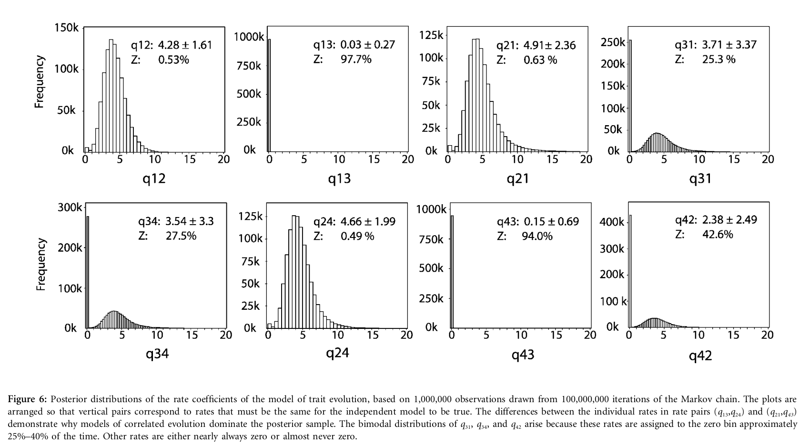

```{r pkgs,message=FALSE}
if (packageVersion("corHMM")<"2.6.1") {
  stop("need hacked version of corHMM. Try 'remotes::install_github(\"bbolker/corHMM\", build_vignettes=TRUE)'")
}
## if installation fails when building vignettes drop build_vignettes=TRUE (default is FALSE)
library(corHMM)
library(bbmle)     ## for likelihood profiles/CIs
library(numDeriv)  ## for Hessian/Wald CIs
library(MCMCpack)  ## for Bayes (Metropolis-Hastings) run
library(coda)
library(lattice)
library(ggplot2); theme_set(theme_bw())
library(colorspace)
library(GGally)
library(ggthemes)
```

I made a *small* change in `corHMM` that has it return a list of the auxiliary variables it sets up
to compute the log-likelihood of any particular set of (log) evolutionary rates. This makes it much
more convenient to do the extra stuff we want to do here (likelihood profiles, Bayesian analysis, etc.)
Run the basic example from `corHMM` [@corHMM]:

```{r ex1,cache=TRUE}
data(primates)
phy <- multi2di(primates[[1]])
data <- primates[[2]]
(MK_3state <- corHMM(phy = phy, data = data, rate.cat = 1))
```

**FIXME**: figure out what the states are and hence what the transition rates are/compare back
with the results from @pagel_bayesian_2006; these are data on mating system and
advertisement of estrus in Old World monkeys and great apes, not sure why there are only three combinations
of states? (Not *that* important but it bugs me to go through an analysis without actually knowing what it means ... might also be useful for comparison.)

Check that we can retrieve the same log-likelihood as above.
(Currently need `:::` to `dev.corhmm`, as it's not exported ...)

```{r check}
do.call(corHMM:::dev.corhmm,MK_3state$args.list)
```

Make a wrapper function that calls `dev.corhmm` with a specified parameter vector,
*and* all the other stuff it needs:

```{r}
nllfun <- function(p) {
  a <- MK_3state$args.list
  a$p <- p
  do.call(corHMM:::dev.corhmm,a)
}
```

Compute Wald confidence intervals (standard-error based)

```{r waldci}
p <- MK_3state$args.list$p
H <- numDeriv::hessian(nllfun, p)
sds <- sqrt(diag(solve(H)))
wald.ci <- sweep(qnorm(0.975)*outer(sds,c(-1,1)),1,FUN="+",STATS=p)
```

Set things up to use the `bbmle` package, which can compute (better) *likelihood profile* confidence intervals (see sections 6.4 and 6.5 of Bolker 2008). Computing the profile is numerically tricky: `corHMM` internally uses bounds of `c(1e-9,100)` on the rates (we are fitting log-rates below), so I use these bounds here to stop the profiling from getting into trouble. (These bounds are making some assumption, I'm not sure what, about the units of branch length/evolutionary time in the phylogeny: we need to **check this** when doing our analysis!)

```{r mle}
names(p) <- parnames(nllfun) <- paste("p",1:4)
nllfun(p) ## check same results as before

## fit an mle2 model
m0 <- mle2(minuslogl=nllfun, start=p, vecpar=TRUE, lower=log(1e-9), upper=log(100),
           method="L-BFGS-B")
```

This next bit is a little slow ...
```{r profile,cache=TRUE}
## standard errors are actually around 0.6; this sets the profile to a finer resolution
print(system.time(pp <- profile(m0,std.err=0.2)))
```

```{r profplot,fig.width=8,fig.height=8,warning=FALSE}
plot(pp,show.points=TRUE)
```

The profiles for the first two rates are wonky (in the best-case scenario, where we could use a Wald approximation instead, the profiles plots would be symmetric V shapes).

Computing 95% CIs based on these profiles:

```{r profci, warning=FALSE}
prof.ci <- confint(pp)
```

## Bayesian

Now we'll convert this to a Bayesian problem by wrapping the negative log-likelihood function
(`dev.corhmm()`) in a function that also adds priors.

- The function I'm going to use (`MCMCpack::MCMCmetrop1R`) wants a function that returns
the **positive** log-posterior value, so we multiply the negative log-likelihood by -1.
- For the priors we take the lower/upper bounds given above and assume that we have a Normal prior (on the log scale) with a mean halfway between the lower and upper bounds and where the bounds fall at $\mu \pm 3\sigma$. Technically, the original bounds are no longer hard bounds (but we do have only a 0.3% prior probability outside of that range)

```{r}
##' @param p parameter vector
##' @param lb lower bound on the log-evolutionary rate
##' @param ub upper bound
##' @param range number of SDs between mean and lower/upper bound
logpostfun <- function(p,lb=log(1e-9),ub=log(1e2),range=3) {
  prior.mean <- (lb+ub)/2
  prior.sd <- (ub-lb)/(2*range)
  loglik <- -1*nllfun(p)
  log.prior <- sum(dnorm(p,mean=prior.mean,sd=prior.sd,log=TRUE))
  return(loglik+log.prior) ## product of likelihood and prior -> sum of LL and log-prior
}
```

```{r metropolis}
fn <- "cache/MK_3state_mcmc.rds"
if (!file.exists(fn)) {
  m1 <- MCMCmetrop1R(logpostfun,p,verbose=1000, mcmc=100000)
  saveRDS(m1, file=fn)
} else {
  m1 <- readRDS(fn)
}
```

Trace plot:

```{r traceplot}
xyplot(m1)
```

```{r bayes_sum}
summary(m1)
raftery.diag(m1)
```

**fixme**: should compute effective sample size, start multiple chains and compute Gelman-Rubin $\hat R$ statistics (this is inconvenient with `MCMCmetrop1R`).

```{r pairs}
pairs(as.matrix(m1),gap=0,pch=".")
```

```{r ggpairs, echo=FALSE}
source("utils.R")
ggpairs(as.data.frame(m1), progress=FALSE,
        lower=list(continuous=function(...) my_mcmc(..., show_prior=TRUE))) +
  theme(panel.spacing=grid::unit(0,"lines"))
```

Here the solid horizontal/vertical lines are the prior means, the dashed lines show ± 2 SD for the priors.

```{r bayes.ci}
bayes.ci <- t(apply(m1,2,quantile,c(0.025,0.975)))
```
```{r all.ci,echo=FALSE}
all.ci <- setNames(
    as.data.frame(rbind(wald.ci,prof.ci,bayes.ci)),
    c("lwr","upr"))

all.ci <- data.frame(rate=rep(factor(1:4),3),
                     method=rep(c("Wald","profile","Bayes"),each=4),
                     est=c(rep(p,2),colMeans(m1)),
                     all.ci)
all.ci$upr[is.na(all.ci$upr)] <- Inf ## extend NA confidence interval to limit of graph

print(ggplot(all.ci,
       aes(rate,est,ymin=lwr,ymax=upr,colour=method))
      + geom_pointrange(position=position_dodge(width=0.5))
      + scale_colour_colorblind(guide=guide_legend(reverse=TRUE))
      + coord_flip()
      + labs(y="estimated evolutionary rate (hazard)")
      )
```                     

The point estimates for Bayes are a bit lower, due to some combination of priors
and averaging differently over the uncertainty in the other priors (we could tease
this apart if we worked a bit harder). All three CIs agree fairly well for rates 3 and 4.
For rates 1 and 2, the upper confidence limits for the profile are much higher, but these
are brought back most of the way by the Bayesian priors.

Additional reading on methods behind `corHMM` (optional!): @beaulieu_identifying_2013, @beaulieu_hidden_2014. (These
papers may focus more on identifying *hidden* or *latent* sources of variability than just looking at the effects
of (ancestrally reconstructed/imputed) traits that are observable in the extant (tip) taxa ...)

## To do

- LE: read this document and the [corHMM vignette](https://cran.r-project.org/web/packages/corHMM/vignettes/corHMMv2.1-vignette.pdf). (Don't worry too much about the "multiple rate categories" issue for now ...)
- (? maybe ?) compare and contrast these results to those derived by model comparison methods in @pagel_bayesian_2006 
- illustrate/implement how to put a constraint on gain vs loss rates. What's up with gain/loss identifiability in the examples? The authors don't seem to be concerned about this/it doesn't seem to be an issue ... why not?
- figure out how to apply `corHMM` to our (3-binary-trait) example with appropriate constraints
- Write/explain more about the contrast between a model-centric and a parameter-centric approach to these analyses (and PCM generally ...)
- ??? implement `dev.corhmm` in [Template Model Builder](https://kaskr.github.io/adcomp/Introduction.html) ??? (This would enable much faster estimation and Bayesian analyses)
- Think more about priors. What is actually a reasonable range? The current values are guessed at from the range set in `corHMM`. Too broad a range breaks `MCMCmetrop1R`, when we go to too extreme a rate value and get numeric errors.  How would we evaluate prior predictive simulations to figure out whether parameters give rise to evolutionary rates/scenarios we would consider unrealistic??

---

Table 1 from Pagel & Meade: $q_{12}$ = gain of multimale system in absence of estrus advertisement; $q_{13}$ = gain of EA in absence of MM system; $q_{24}$=gain of EA in presence of MM; $q_{34}$=gain of MM in presence of EA. $q_{ji}$= loss corresponding to $q_{ij}$.

Phylogeny based on cytochrome B, etc. etc..

Gamma prior on rate coefficients; shape and rate (?) parameters drawn from uniform (0,10)

Obscure statement about branch lengths and rates:

> A factor in choosing the range of the hyperprior is that branch lengths are fixed in most comparative analyses, being given by the trees. This means that the values of the rate parameters can be known only to a constant of proportionality; increasing the branch lengths by a constant multiplier c scales the rate parameters by 1/c so that the product of the rate and branch length remains constant. The mean of the gamma distribution is the product of its two parameters. We drew both at random from the hyperprior, meaning that values up to 100 for the mean could be obtained. If the posterior distributions bunch up at the top end of the 0–100 scale, then the hyperprior’s limits can be shifted or the branches can be scaled to move the rate coefficients to an intermediate value. We updated the gamma prior by drawing new values of a and b from the hyperprior.

Compare results about with Pagel and Meade fig 6?



## References
